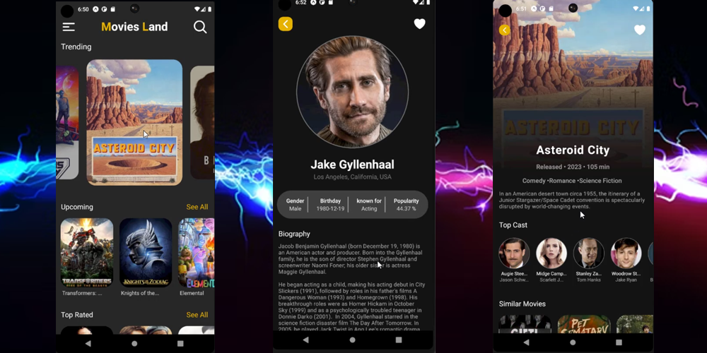

#Android--Movies-land
## Welcome! 👋

Thanks for checking out this Application. 🎉

## Overview
"Movies Land" is a feature-rich Android app designed for movie enthusiasts. It showcases trending and upcoming movies, offers a powerful search function, and provides detailed movie pages with similar movie recommendations, cast information, and more. With its intuitive interface and personalized features, "Movies Land" is the ultimate companion for discovering and exploring the world of movies.

## Screenshots - Vids

Live demonstration GIF 👇.

### Links

- App Download: [Dropbox](https://www.dropbox.com/scl/fi/ft0mfx0457x5rc6tvvfed/Movie-Land.apk?rlkey=sfc36rq9fk5sp0zyxoha76d0e&dl=0)

- App URL: [Github](https://github.com/shaheen7a/Android--Movies-land)

## My process

### Built with

- React Native
- Expo
- NativeWind with custom Styles
- Axios
- IMDB API
- Expo LinearGradient
- Heroicons
- React Native Snap Carousel
- React Native Progres
- JSX

## Author
- Linkedin - [@aous-shaheen-381636221](https://www.linkedin.com/in/shaheen2001/)
- Facebook - [@aoushaheen7](https://www.facebook.com/shaheen72001/)

I appreciate your interest in ChatZone! Stay tuned for future updates and the official release of the app. If you have any questions or feedback, feel free to reach out. 😊🚀
